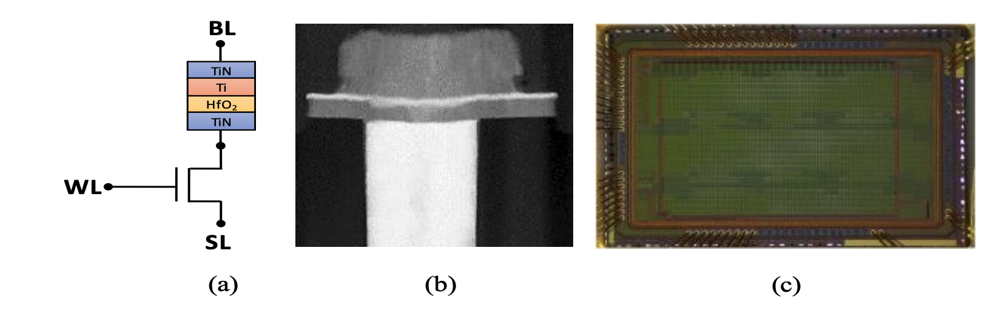
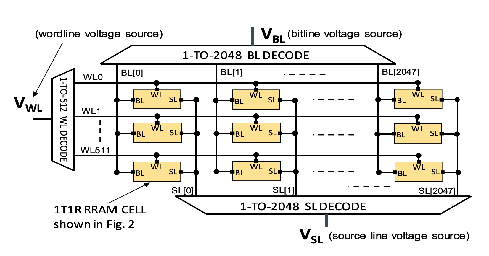
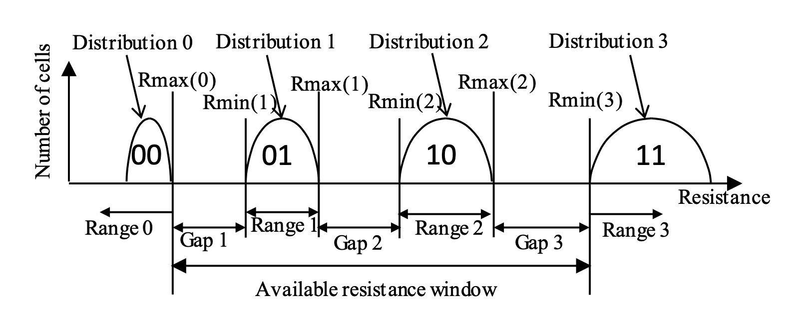

############
 Background
############

.. |HfO2| replace::

   HfO\ :sub:`2`

.. |HfOx| replace::

   HfO\ :sub:`x`

.. |TaOx| replace::

   TaO\ :sub:`x`

.. |TiOx| replace::

   TiO\ :sub:`x`

.. |AlOx| replace::

   AlO\ :sub:`x`

A typical Resistive RAM (RRAM) device consists of a metal-oxide
switching layer (e.g., |HfOx|, |TaOx|, |TiOx|, |AlOx| by atomic layer
deposition) sandwiched by top and bottom metal electrodes, forming a
two-terminal metal-insulator-metal (MIM) structure. As a CMOS-compatible
NVM device, RRAM can be directly fabricated in the back-end-of-line
(BEOL) process without impacting the front-end-of-line (FEOL) portion of
a silicon chip. [[1]_] At SkyWater Technology Foundry, a |HfO2|-based
RRAM layer is fabricated within the BEOL process at multiple points as
described in the physical design rules.

*******************
 General Operation
*******************

RRAM's general operation is as follows: an applied electric field across
the electrodes induces the creation and motion of oxygen vacancies
within the insulator oxide, resulting in the formation of conductive
filaments in the oxide. This changes the device resistance, which varies
between high and low states. [[2]_] There are thus three distinct modes
of operation:

#. Forming, (also referred herein as FORM) during which an initial
   oxygen filament is created.
#. Writing, during which the conductivity of this filament is
   manipulated by the application of electric field.
#. Reading, during which the resistance or conductivity of the filament
   is sensed and converted into a digital value.

During forming, a high electric field is applied to form the filament.
The fresh (un-formed) RRAM cell starts at an ultra-high resistance
(ultra-low conductance state), through the creation of the initial
filament via the formation of oxygen vacancies, a low resistance state
(high conductance state) is reached. Writing can be further broken down
into two distinct modes:

#. RESET – in which resistance is increased (conductance decreased) by
   applying a negative electric field across the device bringing it from
   a low resistance state (LRS) to a high resistance state (HRS)

#. SET – in which resistance is decreased (conductance increased) by
   applying a positive electric field across the device brining it from
   HRS to LRS. The voltages applied during SET/RESET are usually of
   lower magnitude than forming. Reading is usually performed with a
   low-applied voltage (e.g., 0.1-0.2V) using current sensing to
   determine the state of the RRAM device; often the HRS is used to
   store a logical ‘0’ and the LRS stores a logical ‘1’. RRAM setup
   usually follows this sequence: FORM -> RESET -> SET. Leaving cells
   all in a LRS ‘1’ state. Additional SET/RESET cycling can be performed
   to improve the switching reliability, and leave cells in a specified
   state.

Beyond a single RRAM cell, arrays require the use of a control
transistor, creating a 1T-1R structure. This control device is used both
to select the cell within the array but also controls the compliance
current during the FORM, SET, and RESET operations. When thinking about
an RRAM-based system, all three modes must be supported in order to
enable system functionality: e.g., built-in forming must be enabled,
otherwise the RRAM will be non-functional (e.g., SET and RESET
operations have no impact unless the cell filament is first FORMed).

A general RRAM cell schematic, technology, and array architecture are
shown in :numref:`cell_schematic` and :numref:`rram_array` shows the
schematic of the three inputs to an RRAM cell, namely the bitline (BL),
wordline (WL), and source line (SL). The voltages at these inputs can be
used as “knobs” to program the cell resistance to a target range. The
wordline voltage (VWL) controls the compliance current through the RRAM
cell, while the bitline voltage (VBL) and source line voltage (VSL)
control the potential across the cell. In order to perform a SET
operation, VBL is increased while VSL is grounded. To perform a RESET
operation, VSL is increased while VBL is grounded. For both SET and
RESET, VWL must be above the threshold voltage of the control transistor
to enable current flow through the cell.

.. _cell_schematic:

   \(a) Cell schematic, (b) RRAM cell TEM, and (c) die photo of array.

.. _rram_array:

   1T1R RRAM array architecture

Beyond monolithic integration, the use of RRAM arrays offers many
benefits at the system level:

#. RRAM inherently promises higher memory density compared to SRAM due
   to its 1T1R structure.

#. RRAM offers low read energy and latency, due the low voltage of
   reading and large resistance window between HRS and LRS.

#. RRAM is non-volatile, power is not required to maintain an RRAM’s
   resistance value; RRAM-based systems can thus be quickly turned on
   and off enabling fine-grained temporal power gating [[4]_].

#. Additional structures beyond 1T1R (e.g., 1TnR), when monolithically
   integrated, provide RRAM even greater densities [[3]_].

#. RRAM can support multiple bits-per-cell storage, effectively boosting
   storage density [[3]_].

Multiple bits-per-cell storage in RRAM requires dividing up the
resistance range into multiple levels (e.g., not just the single LRS and
HRS of a binary 1-bit cell). These levels can be specified by a set of
ranges and gaps, where cells are considered to be in one digital level
if their resistance is within the corresponding range, and a cell is in
error if left in the gap. This scheme is demonstrated in
:numref:`ranges_and_gaps`.

.. _ranges_and_gaps:

   Ranges and gaps in 2 bits-per-cell RRAM

RRAM cells, after forming, have an available resistance window between
the lowest resistance states achievable and the highest resistance state
achievable (e.g., the LRS and HRS used in binary storage). Determining
how to optimally partition this window for the additional levels in
2-bit, 3-bit and beyond storage is currently under research. In later
sections we will discuss one such technique and show the measured
performance achievable with the SkyWater RRAM technology. Two additional
ideas that are key to understanding RRAM’s capabilities are the
following: retention, e.g., the ability for the RRAM’s resistance to
stay constant throughout time (either with or without power) and
endurance, the limited number of SET-(writing a ‘1’)–RESET-(writing a
‘0’) cycles a memory cell can undergo before permanent write failure
(stuck at the ‘1’ or ‘0’ state). RRAM’s major benefits come with some
additional challenges that must be considered in design, namely:

#. Compared to reads, RRAM has relatively higher write energies and
   latencies.

#. RRAM has limited endurance compared to volatile technologies like
   SRAM and DRAM

#. RRAM faces potential retention challenges at very high temperatures,
   especially if using multiple bits-per-cell storage (this will be In
   the following sections, we provide detailed data quantifying the RRAM
   technology provided at SkyWater.

This technology is still under development and the following procedures
do not guarantee the results indicated. This document will be updated as
necessary to provide the most current data on the process.

************
 References
************

.. [1]

   Rich D\. et al\. (2020) Heterogeneous 3D Nano-systems: The N3XT
   Approach?. In: Murmann B., Hoefflinger B. (eds) NANO-CHIPS 2030. The
   Frontiers Collection. Springer, Cham.
   https://doi-org.stanford.idm.oclc.org/10.1007/978-3-030-18338-7_9

.. [2]

   Wong, HS., Salahuddin, S. Memory leads the way to better computing.
   Nature Nanotech 10, 191–194 (2015).
   https://doi-org.stanford.idm.oclc.org/10.1038/nnano.2015.29

.. [3]

   E\. R\. Hsieh et al., "High-Density Multiple Bits-per-Cell 1T4R RRAM
   Array with Gradual SET/RESET and its Effectiveness for Deep Learning,"
   2019 IEEE International Electron Devices Meeting (IEDM), San Francisco,
   CA, USA, 2019, pp. 35.6.1-35.6.4, doi: 10.1109/IEDM19573.2019.8993514.

.. [4]

   T\. F\. Wu, B. Q. Le, R. Radway, A. Bartolo, W. Hwang, S. Jeong, H. Li,
   P. Tandon, E. Vianello, P. Vivet, E. Nowak, M. K. Wooters, H.-S. P.
   Wong, M. M. Sabry Aly, E. Beigne, S. Mitra "14.3 A 43pJ/Cycle
   Non-Volatile Microcontroller with 4.7μs Shutdown/Wake-up Integrating
   2.3-bit/Cell Resistive RAM and Resilience Techniques," 2019 IEEE
   International Solid- State Circuits Conference - (ISSCC), San Francisco,
   CA, USA, 2019, pp. 226-228, DOI: 10.1109/ISSCC.2019.8662402

.. [5]

   B\. Q\. Le, A. Grossi, E. Vianello, T. Wu, G. Lama, E. Beigne, H.-S. P.
   Wong, S. Mitra, "Resistive RAM with Multiple Bits per Cell: Array-Level
   Demonstration of 3 Bits per Cell," IEEE Transactions on Electron Devices
   Journal, vol. 66, Issue 1, Jan. 2019. 10.1109/TED.2018.2879788
