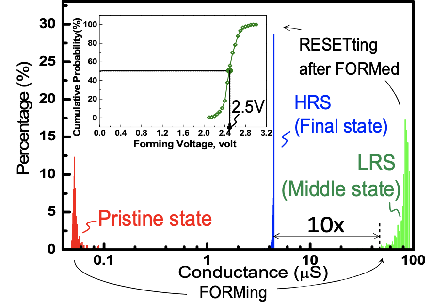
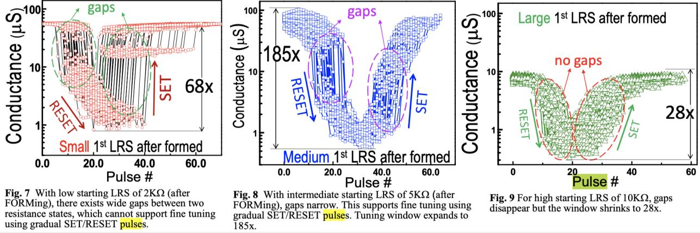
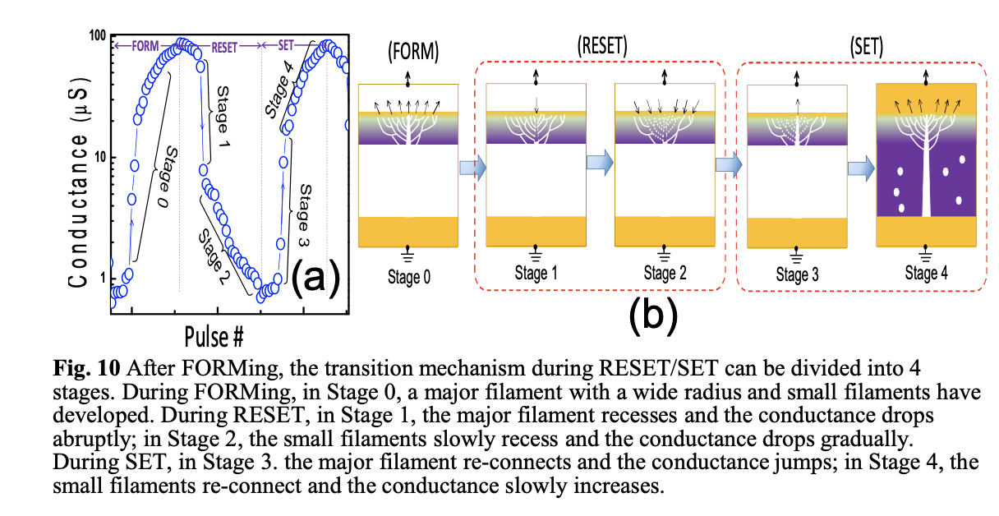
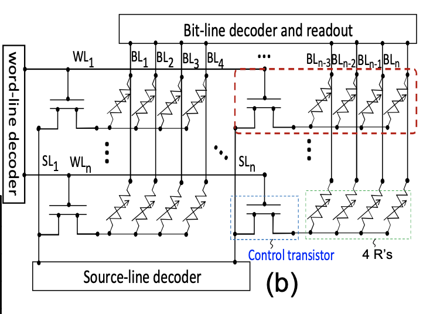
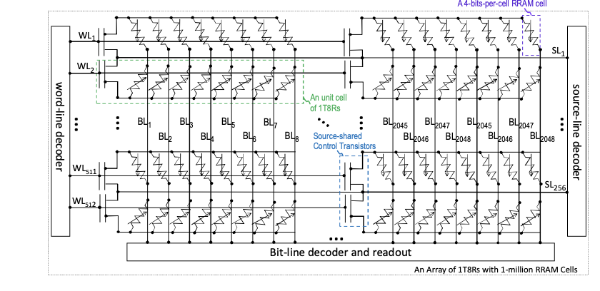
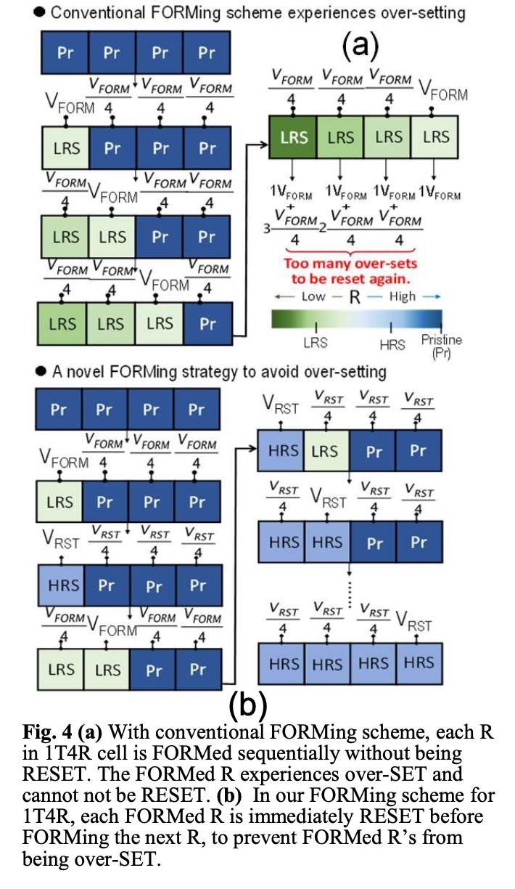
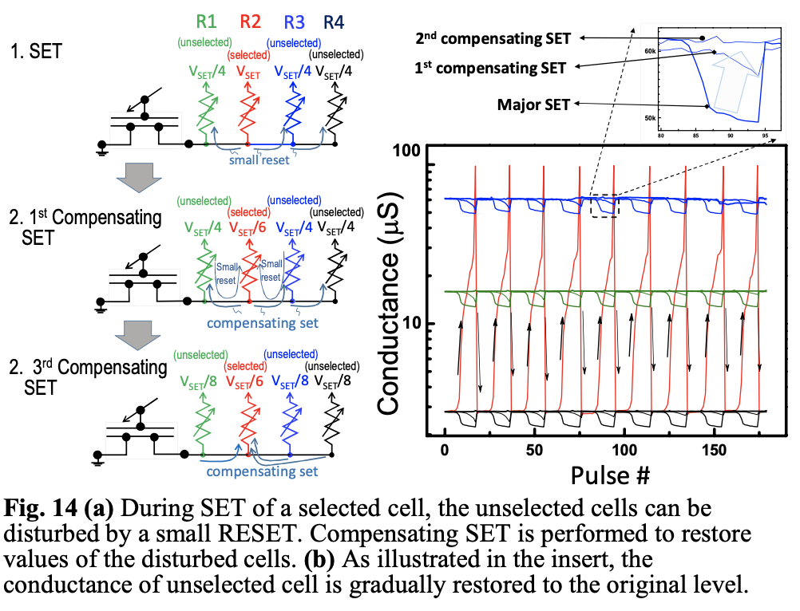
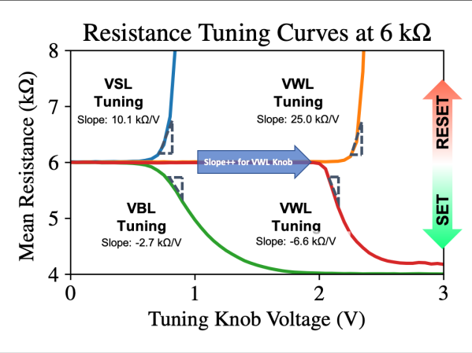

###########################
 Technology Specifications
###########################

.. |HfO2| replace::

   HfO\ :sub:`2`

*********
 FORMing
*********

The figure below shows forming data on a 1Mbit RRAM array. At fresh
(e.g., unformed) the starting conductance of the RRAM ranges below 0.1
uS (e.g., resistance above 10MOhms). To form the cells, voltages from
2.2 to 3.1V are required (average 2.5V), with very high yields (above
99%) achieved with a max forming voltage of 3.1V. After FORM, the RRAMs
end up in an ultra-low LRS of 30-120uS. Resetting the cells after
forming results in an HRS. The forming pulse widths are 1,000ns (e.g.,
1us).

The initial forming conditions impact the final resistance range
achievable with the RRAM cells. Using a higher forming voltage (and
longer forming pulses) result in an initial LRS state with a lower
resistance. Depending on the initial LRS resistance, the sharpness of
the SET/RESET transition and the window between the final LRS/HRS
changes as demonstrated in the figures below. This becomes critical when
determining the multiple bits per cell as a gradual SET/RESET procedure
is needed to fine tune the resistance.

Fig. 10 provides a possible explanation for the results in Figs.7-9. We
can divide the transition curve of conductance into 4 stages. During
FORMing, in Stage 0, a major filament with a wide radius is created in
|HfO2|. In addition, small filaments extend from the tip of the major
filament to the top electrode. During RESET, in Stage 1, the major
filament recesses resulting in abrupt drop in conductance. In Stage 2,
the small filaments slowly recess resulting in gradual reduction of
conductance. During SET, in Stage 3, the major filament reconnects and
the conductance jumps. In Stage 4, the small filaments re-connect and
the conductance slowly increases.

   Figure extracted from [[1]_]

*****************
 SETing/RESETing
*****************

The standard SET/RESET pulses used with the SkyWater RRAM
characteristics are summarized below for binary (e.g., 1-bit/cell) RRAM.
Note that these are dependent on the initial forming conditions used (as
discussed above). For completeness we give those conditions as well.
Where a range is given, the procedure is as follows: first fix the BL
voltage (for FORM/SET, SL voltage for RESET) and increase the WL pulse
amplitude by the step size given until the cell is successfully
formed/set/reset. If the cell is unsuccessful, then increase the BL
voltage by the step size, and so forth.

The following tables were manually transcribed into this format the
original :download:`png
<figures/reram_document_figures/original_tables.png>` is is provided so
that others may check the transcription.

.. csv-table:: 1T1R #5
   :file: figures/reram_document_figures/1T1R_5.csv
   :header-rows: 1
   :align: center

.. csv-table:: 1T4R #4
   :file: figures/reram_document_figures/1T4R_4.csv
   :header-rows: 1
   :align: center

.. csv-table:: 1T4R #9
   :file: figures/reram_document_figures/1T4R_9.csv
   :header-rows: 1
   :align: center

Alternative programming schemes can be used. For example, from our data
on the 1T4R test #9 above, one could consider using a fixed reset pulse
of WL=3V, SL=3V with a 1000ns pulse to ensure high RESET yields.
Additionally, a lower voltage can be tried multiple times (e.g., a
SET/READ and verify, or RESET/READ and verify) until the operation is
successful. The pulse length is also a free variable, shorter (e.g.,
100-200ns SET/RESET) pulses, with a verify scheme can also be used to
reduce average write time.

**************************************************************
 Technology Specs: SkyWater 1T(n)R and Multiple Bits-Per-Cell
**************************************************************

1T(n)R
======

Multiple RRAM cells can be controlled with a single transistor. Such a
layout increases density, especially when integrated monolithically
(with multiple RRAM’s stacked above a single transistor). Below we give
schematics of such 1T4R and 1T8R arrays.

FORMing 1T(n)R
==============

Such arrays require a different forming scheme. The operation of a 1T4R
RRAM array is much more complex (vs. a 1T1R array) since interactions
between multiple cells (in the same 1T4R structure) Fig. 4 presents our
forming approach for 1T4R RRAM array. The conventional approach for 1T1R
FORMs a cell (i.e., induces LRS in that cell) and then proceeds to the
next cell. However, if this conventional scheme is directly applied to
1T4R (Fig. 4a), the FORMed cell, which is already in the low-resistance
state (LRS), will experience additional SET (over-SET) as another cell
inside the same 4R structure is being FORMed. After experiencing
multiple over-SETs, the resistance of a FROMed cell may fall to an
ultra-low value, and it may not be possible to RESET that cell anymore.
The FORMing scheme in Fig. 4b overcomes this challenge by RESETting a
cell (to the high-resistance state or HRS) immediately after it is
FORMed. Therefore, when a cell is being FORMed, the adjacent FROMed but
RESET cells (in the same 1T4R structure) are no longer over-SET.
Occasionally, an adjacent RESET cell may be SET accidentally. It is
necessary to check and RESET all cells in the 1T4R structure before the
next cell is FORMed. Using this strategy, the FORMing yield is 99%. The
forming voltages were given in the tables above.

SETing/RESETing 1T(n)R
======================

While the voltages of SET/RESET are given in the tables above, there are
additional considerations in writing a 1TnR cell. Multiple bits-per-cell
operation of 1T4R RRAM requires more precise control (vs. 1T1R) since
disturbances between adjacent cells (in the same 1T4R structure) will be
more serious. For example, Fig. 14 shows that when a cell in 1T4R is
selected to be SET, the other 3 (unselected) cells can experience a
small RESET, which can disturb the values stored in those (unselected)
cells. Therefore, additional compensating SET operations are needed to
restore the values in those (unselected) cells. By applying the
compensating SETs, the disturbances in the unselected cells can be well
alleviated, as shown in the insert of Fig. 14. The few low- voltage
compensating SET pulses do not affect the other cells.

Multiple Bits-Per-Cell: 1T1R with 2 or 3 Bits-Per-Cell
======================================================

Programming
-----------

Multiple bits-per-cell programming requires fine control over the cell
resistance in order for the cells to end up in the desired range. There
are two techniques that have been explored on the SkyWater RRAM, the
first is demonstrated on a 1T1R structure and can achieve 2 or 3
bits-percell. Adjusting VWL allows for “coarse” tuning of the RRAM
resistance (relatively large resistance change per pulse, but with less
accuracy), while VBL and VSL allow for “fine” tuning (relatively small
resistance change per pulse, but with more accuracy). Fig. 4 depicts the
“tuning curves” at 6kOhm (representative resistance for illustration) in
the SkyWater technology, which shows how the cell resistance (slope) is
more sensitive to changes in VWL than to changes in VBL (for SET) and
VSL (for RESET). A smaller slope signifies that the resistance can be
tuned more slowly/accurately and indicates that voltage noise has a
reduced impact on the change in resistance. We see that SET operations
allow for finer tuning than RESET operations, since the SET operation
results in an increasing voltage drop across the select transistor and a
decreasing voltage drop across the RRAM cell.

.. _tuning_knob:

   Tuning curves showing the sensitivity of resistance change to different
   input knobs for a representative starting resistance of 6kΩ. Slopes
   are measured at 5.5kΩ for SET and 6.5kΩ for RESET. During VSL RESET
   tuning, VWL=3.5V; during VBL SET tuning, VWL=3V; for VWL
   RESET tuning, VSL=2.8V; for VWL SET tuning, VBL=2V. Data is averaged
   across 50 cells with 10 samples per cell. We also tested different
   starting resistances and step sizes (not plotted for clarity). For all
   parameters tested, the data showed that resistance change is more gradual when
   tuning with VBL/VSL rather than VWL.

************
 References
************

.. [1]

   E\. R\. Hsieh et al., "High-Density Multiple Bits-per-Cell 1T4R RRAM
   Array with Gradual SET/RESET and its Effectiveness for Deep Learning,"
   2019 IEEE International Electron Devices Meeting (IEDM), San Francisco,
   CA, USA, 2019, pp. 35.6.1-35.6.4, doi: 10.1109/IEDM19573.2019.8993514.
